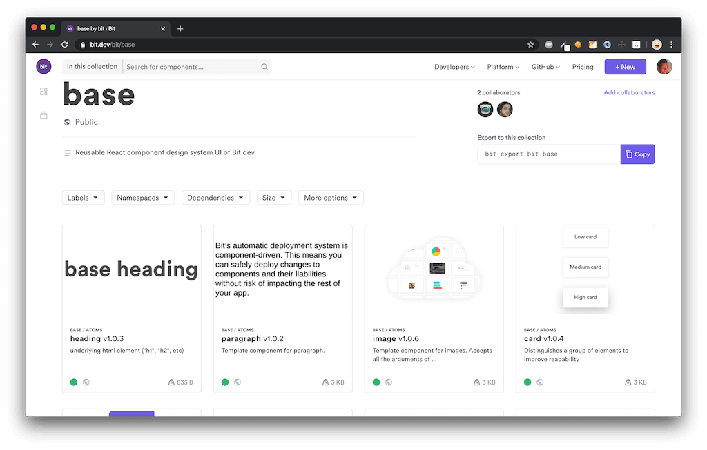

# Base component design system of [Bit.dev](https://bit.dev).

This codebe contains the basic ui components of Bit.dev built with React.

This repo is a **component-based micro-frontend** with a set of independently-useful React components, which are[exposed as a Bit component collection](https://bit.dev/bit/base) and then integrated into the bit.dev platform and website.

## Component collection - choose and use

See the **[base collection on bit.dev](https://bit.dev/bit/base)** to:

- Install independent component with npm/yarn.
- Use `bit import` to source and edit components locally for quick integration. Keep getting managed updates.
- Try any component hands-on in a live playground.

## Structure:

### Theme
All shared styles, colors, sizes, fonts, and css variables, belong here.  
[Theme-provider](https://bit.dev/bit/base/theme/theme-provider) applies all of these styles at the root of your app, and different apps may implement their own unique theme.

### Constants
Hard coded singleton values, like storage-url and enums. In case of change, this central location could update all other components.

### Layout
Components controlling the position of elements in the document. (Grid, breakpoints, etc)

### Atoms
Generic building blocks for any front end application.  
These components are 'vanilla', meaning they should not contain content (like texts or icons) and no specific styles. This is because different designs could look entirely different, so any styles in the base component could lead to a 'CSS Specificity War'. So, add the bare minimum of css here and keep these components purely logical!

### Utils
Pure logic components and helpers. (no visual components)

## Setup
1. Clone the repository
1. [Install bit](https://docs.bit.dev/docs/installation)
1. Run `yarn install` or `npm install` to install all packages.
1. Run `bit import` to sync components.
1. Start hacking!
